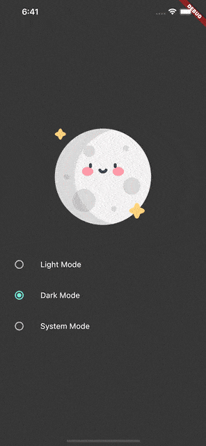

# Dark Mode

## Dependencies

- 状态管理：[provider](https://pub.dev/packages/provider)
- 本地数据：[shared_preferences](https://pub.dev/packages/shared_preferences)

- 开屏视频播放：[video_player](https://pub.dev/packages/video_player)
- 开圈动画：[circular_reveal_animation](https://pub.dev/packages/circular_reveal_animation)

## Examples

- [dark-mode-in-flutter](https://github.com/vinodbaste/dark-mode-in-flutter)
- [provider_explained_theme](https://github.com/md-weber/provider_explained_theme)
- [Flutter-Devfest](https://github.com/flutter-devs/Flutter-Devfest)、[Implement Dark Mode in Flutter using Provider](https://medium.flutterdevs.com/implement-dark-mode-in-flutter-using-provider-158925112bf9)
